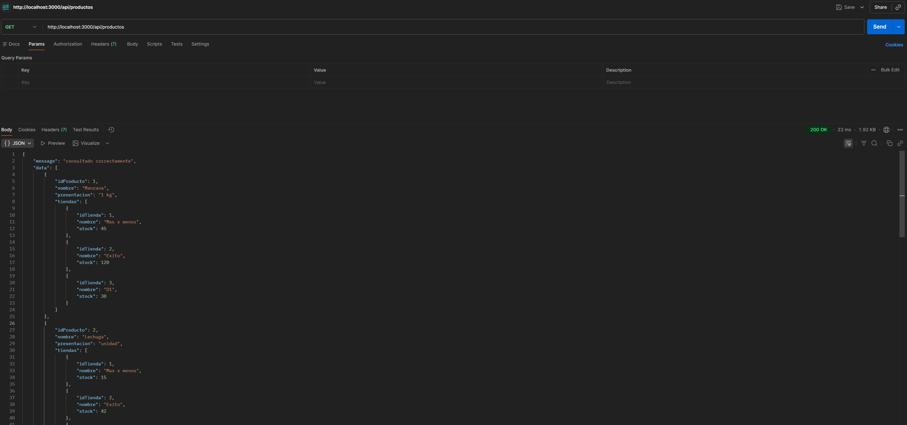
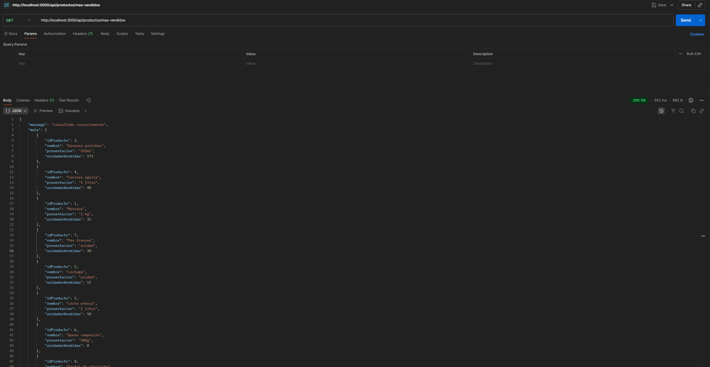
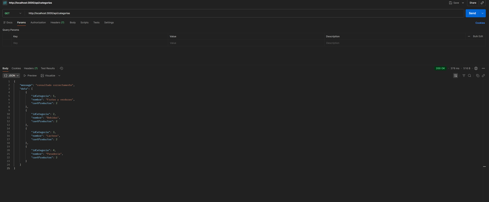
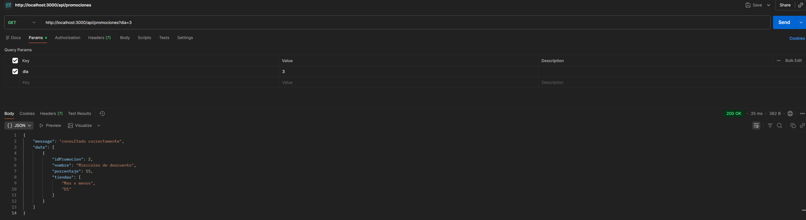
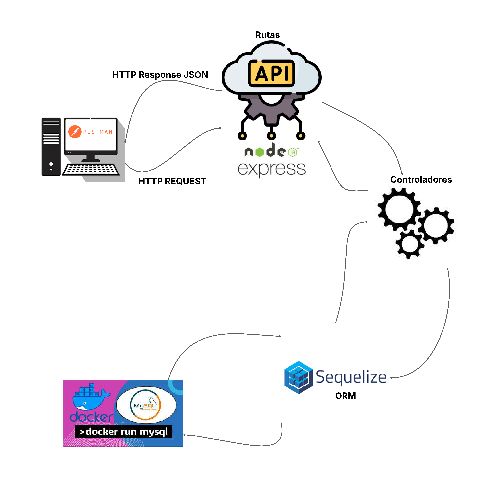

# Diego Debroy - Prueba Técnica Node.js

## API Market
 
### Descripción

API REST desarrollada con Node.js, Express y Sequelize ORM para la gestión de un sistema de market, incluyendo productos, tiendas, promociones y ventas.

### Tecnologías Utilizadas

- Node.js
- Express
- Sequelize ORM
- MySQL
- Docker
- Postman

### Requisitos Previos

- Node.js versión 18 o superior
- Docker y Docker Compose
- Postman para pruebas de endpoints

### Instalación y Configuración

1. Clonar el repositorio

git clone 
https://github.com/ddebroy08/Diego-Debroy-prueba-node.git

cd Diego-Debroy-prueba-node

2. Instalar dependencias

npm install

3. Configurar variables de entorno

Crear archivo .env en la raiz con el siguiente contenido:

PORT=3000
DB_HOST=localhost
DB_PORT=3307
DB_USER=root
DB_PASSWORD=root123
DB_NAME=Market

4. Levantar la base de datos con Docker

docker-compose up -d

5. Crear las tablas en la base de datos

node sync.js

6. Insertar datos de prueba

node seed.js

7. Iniciar el servidor

npm run dev

El servidor estara disponible en http://localhost:3000

### Endpoints

1. Listar productos con stock por tienda

Metodo: GET
URL: http://localhost:3000/api/productos



```
{
    "message": "consultado correctamente",
    "data": [
        {
            "idProducto": 1,
            "nombre": "Manzana",
            "presentacion": "1 kg",
            "tiendas": [
                {
                    "idTienda": 1,
                    "nombre": "Mas x menos",
                    "stock": 45
                }
            ]
        }
    ]
}
```
2. Top 10 productos mas vendidos

Metodo: GET
URL: http://localhost:3000/api/productos/mas-vendidos



Respuesta:
```
{
    "message": "consultado correctamente",
    "data": [
        {
            "idProducto": 3,
            "nombre": "Gaseosa postobon",
            "presentacion": "355ml",
            "unidadesVendidas": 173
        }
    ]
}
```

3. Categorias con al menos un producto

Metodo: GET
URL: http://localhost:3000/api/categorias



Respuesta:
```
{
    "message": "consultado correctamente",
    "data": [
        {
            "idCategoria": 1,
            "nombre": "Frutas y verduras",
            "cantProductos": 2
        }
    ]
}
```

4. Promociones segun dia de la semana

Metodo: GET
URL: http://localhost:3000/api/promociones?dia=3

Parametros:
- dia: Numero del 1 al 7 donde 1=Lunes, 2=Martes, 3=Miercoles, 4=Jueves, 5=Viernes, 6=Sabado, 7=Domingo




Respuesta:
```
{
    "message": "consultado correctamente",
    "data": [
        {
            "idPromocion": 2,
            "nombre": "Miercoles de descuento",
            "porcentaje": 15,
            "tiendas": ["Mas x menos", "D1"]
        }
    ]
}
```

### Scripts Disponibles

npm start: Inicia el servidor en modo produccion
npm run dev: Inicia el servidor con nodemon (recarga automatica)

Decisiones Tecnicas

- Sequelize ORM: Requisito obligatorio de la prueba tecnica
- MySQL en contenedor Docker: Para entornos consistentes y portabilidad
- Arquitectura por capas: Separacion de controladores, modelos y rutas
- GitFlow simplificado: Rama develop para desarrollo, main para versiones estables

Mejoras Propuestas

- Agregar autenticacion y autorizacion con JWT
- Implementar paginacion en endpoints de listado
- Agregar validaciones de datos con Joi o express-validator
- Implementar tests unitarios con Jest
- Documentacion con Swagger


Diagrama de Arquitectura



Explicacion en texto plano:

CAPA PRESENTACION
- Cliente: Postman, Navegador, Frontend
- Realiza peticiones HTTP a los endpoints

CAPA API
- Express.js: Servidor HTTP
- Rutas: Redirigen peticiones a controladores
- Middlewares: Procesan datos JSON

CAPA LOGICA DE NEGOCIO
- Controladores: Procesan las peticiones
  -> productoController.js
  -> promocionController.js
- Validan datos
- Llaman a los modelos

CAPA ACCESO A DATOS
- Sequelize ORM: Mapeo objeto-relacional
- Modelos: Representan las tablas
  -> Producto, Tienda, Categoria, Promocion, Pedido
- Relaciones: N:N, 1:N, N:1

CAPA DATOS
- MySQL: Base de datos relacional
- Docker: Contenedor con MySQL 8.0
- Volumen persistente: mysql_data

FLUJO DE DATOS

Peticion GET /api/productos

1. Cliente envia GET http://localhost:3000/api/productos
2. Express recibe la peticion
3. Router dirige a productoController.listarProductosConStock
4. Controlador llama a Producto.findAll() con Sequelize
5. Sequelize genera SQL y ejecuta en MySQL
6. MySQL devuelve los datos
7. Sequelize transforma a objetos JavaScript
8. Controlador formatea la respuesta
9. Express envia JSON al cliente

DEPENDENCIAS PRINCIPALES

express         -> Framework web (Capa API)
sequelize       -> ORM (Capa datos)
mysql2          -> Driver MySQL (Capa datos)
dotenv          -> Variables entorno
nodemon         -> Recarga automatica (desarrollo)

### Contacto

Diego Debroy

GitHub: ddebroy08

Correo: ddebroysalazar@gmail.com